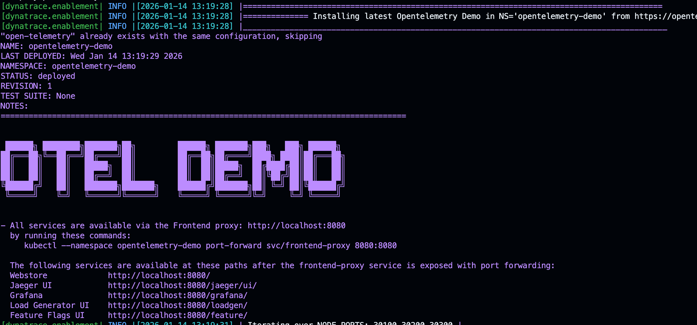

<!-- markdownlint-disable-next-line -->
#   Codespaces OpenTelemetry Demo

___

Sample repository deploying the OpenTelemetry Astronomy Shop, a microservice-based distributed system intended to illustrate the implementation of OpenTelemetry in a near real-world environment.

The Application is being deployed using the helm approach described here

https://opentelemetry.io/docs/demo/kubernetes-deployment/

Using codespaces the app requires at least a machine with 4 core.

The following services will be available at these paths after the frontend-proxy service is exposed using NodePort 30100

Webstore             http://localhost:30100/
Jaeger UI            http://localhost:30100/jaeger/ui/
Grafana              http://localhost:30100/grafana/
Load Generator UI    http://localhost:30100/loadgen/
Feature Flags UI     http://localhost:30100/feature/

## [👨‍🏫 Learn more about the OpenTelemetry Demo in Codespaces!](https://dynatrace-wwse.github.io/demo-opentelemetry)
