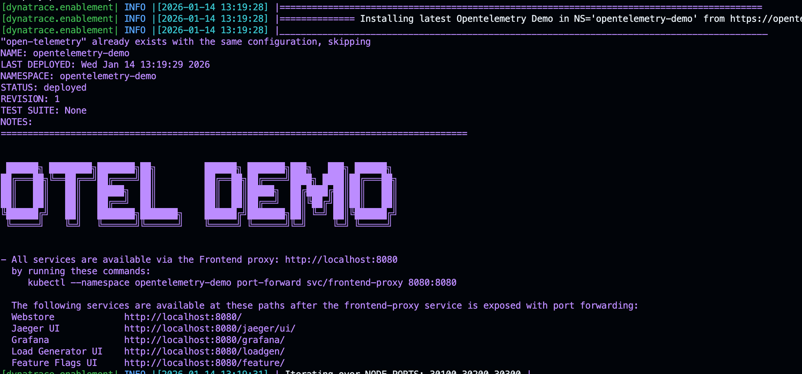

!!! warning "Not yet migrated to the Dynatrace Enablement App"
    This content has not been migrated to a fully immersive, interactive and self-service training.
    Questions or feedback? Reach out to the Center of Excellence Enablement Team via
    [GitHub Issues](https://github.com/dynatrace-wwse/codespaces-framework/issues)
    or the [feedback form](https://forms.office.com/r/QaCx6VAJe8).

--8<-- "snippets/disclaimer.md"

# OpenTelemetry Demo

This repository runs the **OpenTelemetry Demo** — the *Astronomy Shop*, a microservice web shop that
the Cloud Native Computing Foundation (CNCF) OpenTelemetry project maintains to show OpenTelemetry
in a near real-world system.

Nothing here is a fork: the Codespace installs the **upstream** application with the official
`open-telemetry/opentelemetry-demo` Helm chart, into a local Kubernetes ([k3d](https://k3d.io/){target="_blank"})
cluster. For the application itself, read the upstream documentation:

- [OpenTelemetry Demo documentation](https://opentelemetry.io/docs/demo/){target="_blank"}
- [Kubernetes deployment (Helm)](https://opentelemetry.io/docs/demo/kubernetes-deployment/){target="_blank"}
- [Source code on GitHub](https://github.com/open-telemetry/opentelemetry-demo){target="_blank"}

  

- [Let's begin :octicons-arrow-right-24:](2-getting-started.md)

